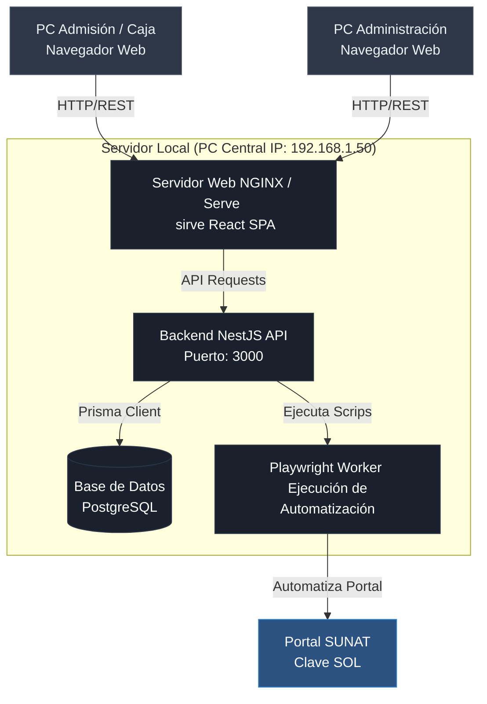
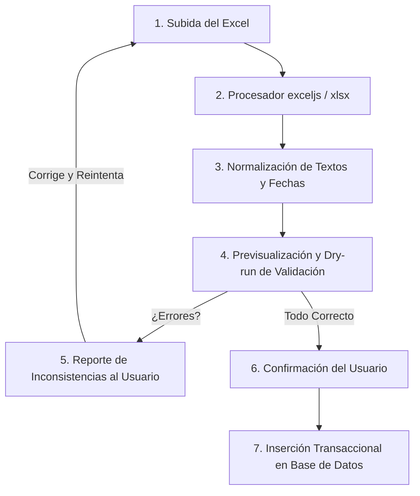

# Plan de Implementación: Sistema local para Centro Médico (Medic)

Este documento detalla la arquitectura, el modelo de datos relacional optimizado y las fases para el desarrollo de un sistema local integrado (NestJS, Prisma, PostgreSQL, React+Vite) con automatización SUNAT (Playwright), importación de Excel históricos y una **interfaz de Admisión/Ventas de alto rendimiento** para dar la mejor atención al paciente.

---

## 1. Arquitectura de Software Local y Red Local

El sistema se desplegará en una arquitectura cliente-servidor dentro de la red local (LAN) de la clínica.



---

## 2. Mapeo Detallado de Campos del Excel

Para asegurar que no se pierda ningún dato ingresado a mano en el Excel actual, se mapean todos los campos al nuevo modelo de datos:

| Pestaña Excel | Campo Excel | Destino Base de Datos | Justificación / Tipo |
| :--- | :--- | :--- | :--- |
| **CONSULTAS / ECO / RX / SERV** | PACIENTE | `Paciente.nombre` | Nombre completo del paciente (No único) |
| | N° CELULAR | `Paciente.celular` | Teléfono de contacto |
| | PROCEDENCIA | `Procedencia.nombre` | Lugar de procedencia estandarizado |
| | DOCTOR A CARGO | `Medico.nombre` | Profesional que realiza la atención |
| | GRADO | `Medico.grado` | Grado académico: "Doctor", "Licenciada", "Enfermera" |
| | TICKET | `Ticket.numeroTicket` | Correlativo diario manual o automático |
| | N° BOLETA | `Ticket.numeroBoleta` | Número de comprobante SUNAT |
| | ESPECIALIDAD / TIPO | `Tarifa.especialidad` / `Tarifa.categoria` | Especialidad médica del tarifario |
| | TIPO DE ECOGRAFIA / CIRUGIA / RX | `Ticket.descripcionAdicional` | Detalle específico (Ej. Apendicitis, Reno vesical) |
| | C. PACIENTE | `Ticket.montoPaciente` | Costo pagado por el paciente |
| | MEDICO | `Ticket.montoMedico` | Comisión asignada al doctor |
| | CLINICA / MONTO TOTAL | `Ticket.montoClinica` | Margen neto restante para la clínica |
| **RAYOS X** | ENCARGADO DE LA TOMA | `Ticket.nombreTecnico` | Técnico de placas (Ej. Samuel) |
| | Comisión Samuel | `Ticket.montoTecnico` | Comisión fija por placa de Rayos X (Ej. S/. 5) |
| | DOCTOR SOLICITANTE | `Ticket.medicoSolicitante` | Doctor externo que derivó al paciente (comisión S/. 20) |
| **CERTIFICADOS** | FORMULARIO / N° | `Ticket.certificadoFormulario` / `Ticket.certificadoNumero` | Tipo de formulario y código físico de SUNAT |
| **HISTORIAS CLINICAS** | PERSONA QUE SOLICITA | `Ticket.solicitanteHistoriaClinica` | Quién solicita la copia fedateada |
| | HIST. CL. | `Paciente.numeroHistoriaClinica` | Número único de historia clínica del paciente |
| **EGRESOS / PAGOS FIJOS / PLANILLA** | PROVEEDOR / RUC | `Egreso.proveedor` / `Egreso.ruc` | Datos de facturación de compras |
| | N° de Operación / REC | `Egreso.numeroComprobante` | Operación bancaria o correlativo de recibo |
| | DETALLE / OBSERVACIONES | `Egreso.observaciones` | Glosa descriptiva del gasto |
| | MONTO / TOTAL | `Egreso.monto` | Importe egresado |
| **DIETAS** | DESAYUNO/ALMUERZO/CENA | `Dieta.desayunoCant` / `Dieta.almuerzoCant` | Cantidad de raciones registradas |

---

## 3. Modelo de Datos Relacional (Esquema Prisma)

Este esquema se ha corregido para:
1. **Eliminar el constraint único del nombre de Pacientes** (para permitir homónimos).
2. **Normalizar la procedencia mediante una tabla `Procedencia`**: Se precargará con el Ubigeo oficial de Perú (Departamentos, Provincias y Distritos) y con los centros poblados/caseríos locales detectados en los Excel (como "Ciudad de Dios", "Tolón", "Pacanguilla", "Jaguey") para evitar errores de ortografía en caja (ej: "Chequen" o "Cruce Cajarmca").
3. **Agregar el modelo `Dieta`** para registrar las raciones de alimentos detalladas en el Excel.
4. **Agregar campos de control de auditoría de Caja Chica** (`CajaDiaria`) para diferenciar ingresos digitales de efectivo físico y calcular sobrantes/faltantes.

```prisma
datasource db {
  provider = "postgresql"
  url      = env("DATABASE_URL")
}

generator client {
  provider = "prisma-client-js"
}

enum EstadoTicket {
  ACTIVO
  ANULADO
}

enum TipoEgreso {
  GASTO
  PLANILLA
  PAGO_FIJO
  DEVOLUCION
  ASCENSOR
  OTROS
}

enum MetodoPago {
  EFECTIVO
  PLIN
  TRANSFERENCIA
}

model Procedencia {
  id           Int        @id @default(autoincrement())
  nombre       String     @unique // Ej: "Ciudad de Dios", "Chepén", "Guadalupe", "Tolón"
  distrito     String?    // Mapeo oficial de Ubigeo (Ej: "Guadalupe")
  provincia    String?    // Mapeo oficial de Ubigeo (Ej: "Pacasmayo")
  departamento String?    // Mapeo oficial de Ubigeo (Ej: "La Libertad")
  pacientes    Paciente[]

  @@map("procedencias")
}

model Paciente {
  id                    Int         @id @default(autoincrement())
  nombre                String
  celular               String?
  numeroHistoriaClinica String?     // Mapea "HIST. CL."
  procedenciaId         Int
  procedencia           Procedencia @relation(fields: [procedenciaId], references: [id])
  creadoEn              DateTime    @default(now())
  tickets               Ticket[]

  @@index([nombre])
  @@index([celular])
  @@map("pacientes")
}

model Medico {
  id                  Int      @id @default(autoincrement())
  nombre              String   @unique
  especialidad        String
  grado               String   // Doctor, Licenciada, Enfermera
  celular             String?
  creadoEn            DateTime @default(now())
  ticketsAtendidos    Ticket[] @relation("MedicoCargo")
  ticketsSolicitados  Ticket[] @relation("MedicoSolicitante")

  @@map("medicos")
}

model Tarifa {
  id                Int      @id @default(autoincrement())
  categoria         String   // Consulta, Ecografía, Rayos X, SOP, Certificado, Historia Clínica Fedateada
  especialidad      String
  descripcion       String
  precioTotal       Decimal  @db.Decimal(10, 2)
  tipoReparto       String   // PORCENTAJE o FIJO
  comisionMedico    Decimal  @db.Decimal(10, 2)
  comisionClinica   Decimal  @db.Decimal(10, 2)
  requiereTecnico   Boolean  @default(false)
  comisionTecnico   Decimal  @default(0.00) @db.Decimal(10, 2) // Comisión fija (Samuel)
  creadoEn          DateTime @default(now())
  tickets           Ticket[]

  @@map("tarifas")
}

model CajaDiaria {
  id                     Int         @id @default(autoincrement())
  fecha                  DateTime    @unique @db.Date
  montoApertura          Decimal     @db.Decimal(10, 2) // Efectivo inicial en caja chica
  montoEfectivoEsperado  Decimal     @default(0.00) @db.Decimal(10, 2) // Apertura + Ventas Efectivo - Egresos
  montoEfectivoReal      Decimal?    @db.Decimal(10, 2) // Efectivo físico contado al cierre
  diferenciaCierre       Decimal     @default(0.00) @db.Decimal(10, 2) // Real - Esperado (Sobrante/Faltante)
  montoDigitalEsperado   Decimal     @default(0.00) @db.Decimal(10, 2) // Suma de PLIN/Transferencias
  fechaApertura          DateTime    @default(now())
  fechaCierre            DateTime?
  abierta                Boolean     @default(true)
  observaciones          String?
  tickets                Ticket[]
  egresos                Egreso[]
  depositos              Deposito[]
  dietas                 Dieta[]

  @@map("cajas_diarias")
}

model Ticket {
  id                         Int          @id @default(autoincrement())
  numeroTicket               String       @unique // Correlativo diario
  numeroBoleta               String?      // SUNAT Boleta
  fecha                      DateTime     @default(now())
  pacienteId                 Int
  paciente                   Paciente     @relation(fields: [pacienteId], references: [id])
  medicoId                   Int
  medico                     Medico       @relation("MedicoCargo", fields: [medicoId], references: [id])
  medicoSolicitanteId        Int?
  medicoSolicitante          Medico?      @relation("MedicoSolicitante", fields: [medicoSolicitanteId], references: [id])
  tarifaId                   Int
  tarifa                     Tarifa       @relation(fields: [tarifaId], references: [id])
  descripcionAdicional       String?      // Cirugía específica, tipo de placa o ecografía
  metodoPago                 MetodoPago
  montoPaciente              Decimal      @db.Decimal(10, 2)
  montoMedico                Decimal      @db.Decimal(10, 2)
  montoClinica               Decimal      @db.Decimal(10, 2)
  montoTecnico               Decimal      @db.Decimal(10, 2)
  nombreTecnico              String?      // Ej: Samuel
  certificadoFormulario      String?      // Certificados Medicos
  certificadoNumero          String?      // N° Formulario
  solicitanteHistoriaClinica String?      // Quien solicita la historia fedateada
  estado                     EstadoTicket @default(ACTIVO)
  cajaDiariaId               Int
  cajaDiaria                 CajaDiaria   @relation(fields: [cajaDiariaId], references: [id])
  sunatProcesado             Boolean      @default(false)
  sunatError                 String?
  creadoEn                   DateTime     @default(now())

  @@index([fecha])
  @@index([medicoId])
  @@index([cajaDiariaId])
  @@map("tickets")
}

model Egreso {
  id                Int        @id @default(autoincrement())
  fecha             DateTime   @default(now())
  tipoEgreso        TipoEgreso
  subcategoria      String?    // Proyectos ("Ascensor", "Compra Activos")
  numeroComprobante String?
  proveedor         String?
  ruc               String?
  observaciones     String
  monto             Decimal    @db.Decimal(10, 2)
  ticketAnuladoId   Int?
  cajaDiariaId      Int
  cajaDiaria        CajaDiaria @relation(fields: [cajaDiariaId], references: [id])
  creadoEn          DateTime   @default(now())

  @@index([fecha])
  @@index([cajaDiariaId])
  @@map("egresos")
}

model Deposito {
  id              Int        @id @default(autoincrement())
  fecha           DateTime   @default(now())
  banco           String
  numeroOperacion String
  concepto        String     // PLIN, DEPÓSITO EN EFECTIVO, etc.
  monto           Decimal    @db.Decimal(10, 2)
  cajaDiariaId    Int
  cajaDiaria      CajaDiaria @relation(fields: [cajaDiariaId], references: [id])
  creadoEn        DateTime   @default(now())

  @@index([fecha])
  @@index([cajaDiariaId])
  @@map("depositos")
}

model Dieta {
  id            Int        @id @default(autoincrement())
  fecha         DateTime   @default(now())
  desayunoCant  Int        @default(0)
  almuerzoCant  Int        @default(0)
  cenaCant      Int        @default(0)
  observaciones String?
  monto         Decimal    @db.Decimal(10, 2)
  cajaDiariaId  Int
  cajaDiaria    CajaDiaria @relation(fields: [cajaDiariaId], references: [id])
  creadoEn      DateTime   @default(now())

  @@index([fecha])
  @@index([cajaDiariaId])
  @@map("dietas")
}
```

---

## 4. Diseño UX/UI Optimizado para la Admisión/Ventas

Para garantizar una **atención rápida y profesional** al paciente en recepción, diseñaremos la pantalla de admisión bajo los siguientes criterios:

```
+-----------------------------------------------------------------------------------+
|  CENTRO MÉDICO "MEDIC" - MÓDULO DE ADMISIÓN Y CAJA               Caja Abierta: S/. 120.00 |
+-----------------------------------------------------------------------------------+
|  [ PACIENTE ]                                                                     |
|  Celular: [ 954001113          ] -> Buscar automático                             |
|  Nombre:  [ Jeffry Julca Roman                                                  ] |
|  Proced.: [ Ciudad de Dios     ] (Autocompletar pueblo/ciudad)                    |
|  Hist.Cl: [ 5024               ] (Opcional)                                       |
+-----------------------------------------------------------------------------------+
|  [ DETALLES DE LA ATENCIÓN ]                                                      |
|  Categoría:   (x) Consulta   ( ) Ecografía   ( ) Rayos X   ( ) SOP   ( ) Certif.  |
|  Especialidad:[ Medicina General            ]   Médico:[ Joseph Cabanillas      ] |
|  Servicio:    [ Consulta General (S/. 80.00)                                    ] |
|  Detalle/Obs: [ Control mensual postoperatorio                                  ] |
+-----------------------------------------------------------------------------------+
|  [ DISTRIBUCIÓN EN TIEMPO REAL (SPLIT) ]                                          |
|  Total Cobrado: S/. 80.00  |  Médico (50%): S/. 40.00  |  Clínica (50%): S/. 40.00 |
+-----------------------------------------------------------------------------------+
|  [ PAGO Y COMPROBANTE ]                                                           |
|  Método de Pago: [Efectivo [F1] ] [QR Yape [F2] ] [QR Plin [F3] ] [Depósito [F4] ] |
|  ¿Emitir Boleta SUNAT?: [x] Sí (Cola automatizada de Playwright) / [ ] No         |
+-----------------------------------------------------------------------------------+
|  [ BOTONES DE ACCIÓN ]                                                            |
|           [ REGISTRAR E IMPRIMIR TICKET (Enter) ]        [ ANULAR / LIMPIAR (Esc) ]|
+-----------------------------------------------------------------------------------+
```

### Características de Venta y Experiencia de Usuario:
1. **Autosugestión / Búsqueda Predictiva**:
   - Al digitar el número de celular del paciente, el sistema busca en la base de datos local y, si ya existe, autocompleta el Nombre, la Procedencia y su Historia Clínica.
2. **Creación Inline de Pacientes**:
   - Si el celular no existe, el foco se mueve a "Nombre" permitiendo registrar al paciente nuevo en el mismo formulario sin tener que salir a otra pantalla.
3. **Control y Cálculo de Comisiones al Instante**:
   - Al elegir la tarifa (ej. Rayos X), el sistema calcula inmediatamente los splits. Si tiene comisiones complejas (Ej. Técnico Samuel S/. 5, Médico Solicitante S/. 20), el desglose se muestra visualmente para evitar dudas.
4. **Códigos QR Dinámicos en Pantalla**:
   - Si la recepcionista selecciona "QR Yape" o "QR Plin", se mostrará en la pantalla un código QR para que el paciente lo escanee desde su celular de forma inmediata.
5. **Comportamiento por Teclado (Ergonomía)**:
   - Foco automático en los inputs. Atajos de teclado (shortcuts): `F1`-`F4` para métodos de pago, `Enter` para emitir el ticket. Esto permite atender de manera fluida sin tocar el mouse.
6. **Impresión Térmica Directa**:
   - Al guardar la venta, el sistema abrirá un layout optimizado para impresoras térmicas de 80mm de ancho (tiqueadora común) para entregarle un ticket de control físico de forma instantánea al paciente.

---

## 5. Módulo Importer de Excel Histórico (Importación sin fallas)

Para migrar la historia de los meses anteriores sin cometer errores y poblar la base de datos PostgreSQL de forma masiva, diseñaremos un motor de importación inteligente en NestJS.



### Funciones Clave del Importer:
1. **Normalización Inteligente**:
   - **Nombres de Médicos**: Limpieza de espacios extras, eliminación de tildes para búsqueda de coincidencias y resolución de variaciones (Ej: "Carlos Sánchez", "Dr. Carlos Sanchez" -> "Carlos Sánchez").
   - **Especialidades**: Mapeo automático de especialidades (Ej: "GinecoloGía", "Ginecologia" -> "Ginecología").
   - **Fechas de Excel**: Conversión automática del formato numérico serial de Excel (ej: 46175) a fechas reales de Javascript/Postgres.
2. **Creación Automática de Entidades**:
   - Si se encuentra un nuevo paciente, médico o tarifa que no exista en el sistema, se creará automáticamente en la base de datos durante la importación.
3. **Dry-Run (Previsualización de Impacto)**:
   - Antes de guardar nada en la base de datos, el sistema leerá el archivo y mostrará un resumen detallado en pantalla:
     - *Ingresos totales calculados (Ej. S/. 78,558.63).*
     - *Cantidad de tickets a importar (Ej. 524 tickets).*
     - *Cantidad de egresos detectados (Ej. 42 egresos).*
     - *Médicos nuevos detectados (Ej. "Randy Rebaza" - se creará nuevo registro).*
   - Si el administrador ve que los números cuadran con sus cuadernos físicos, presiona "Confirmar Importación" y los datos se guardan de forma permanente.
4. **Manejo de Transacciones**:
   - Toda la importación de un mes se ejecutará dentro de una transacción de base de datos (`Prisma.$transaction`). Si un solo registro falla, se hace rollback automático de todo el archivo, garantizando que no queden datos corruptos o a medias.

---

## 6. Plan de Fases de Trabajo Actualizado

1. **Fase 1: Configuración de Base de Datos y Backend (NestJS + Prisma)**:
   - Levantar instancia local de PostgreSQL.
   - Configurar el backend inicial de NestJS con Prisma y aplicar las migraciones correspondientes.
2. **Fase 2: Motor de Importación de Excel (Backend + Test de junio)**:
   - Implementar el cargador y validador de Excel histórico (`xlsx` / `exceljs`).
   - Importar el archivo consolidado de junio 2026 proporcionado y validar que cuadre al 100% con los reportes del Excel original.
3. **Fase 3: Frontend Estático y Configuración (React + Vite)**:
   - Crear el boilerplate con Tailwind CSS y componentes de Shadcn/ui.
   - Crear las pantallas para administrar médicos, configurar el tarifario dinámico, registrar pacientes y **pantalla de carga de archivos Excel**.
4. **Fase 4: Módulo de Caja Diaria y Tickets**:
   - Programar el flujo de apertura, transacciones, anulaciones automáticas (que generan egresos de tipo devolución) y el cierre de caja diario.
5. **Fase 5: Automatización de la SUNAT (Playwright Worker)**:
   - Desarrollar el bot local de Playwright integrado en NestJS para la carga de comprobantes mediante Clave SOL.
   - Panel de control en el frontend para ver el estado de la cola de emisión (Pendiente, Procesado, Error) y botón de reintento.
6. **Fase 6: Liquidación Médica y Dashboard**:
   - Crear el generador de reportes de comisiones de médicos (con filtros de fecha) y el dashboard de utilidades netas.
7. **Fase 7: Despliegue en Red Local**:
   - Configurar la IP fija en la máquina servidor.
   - Crear los scripts de inicio y apagado para facilitar el mantenimiento por parte del personal de la clínica.

---

## 7. Preguntas de Confirmación

> [!IMPORTANT]
> **Por favor, confírmanos estos detalles operativos para proceder:**
> 
> 1. **Acceso a la SUNAT**: ¿La clínica emite actualmente boletas electrónicas mediante el portal web de la SUNAT (Clave SOL) o usan algún facturador integrado? Esto nos confirmará que la automatización de Playwright debe imitar el flujo exacto del portal SOL.
> 2. **Doble Comisión en Rayos X**: En tus atenciones del Excel, ¿esta comisión de Samuel (S/. 5) se le resta de su parte a la clínica o se trata como un costo externo? (Según el Excel, la clínica cobra S/. 100, el médico solicitante S/. 20 y el técnico S/. 5, siendo el total cobrado al paciente de S/. 120. Por lo tanto, parece ser una distribución directa de los S/. 120 cobrados).
